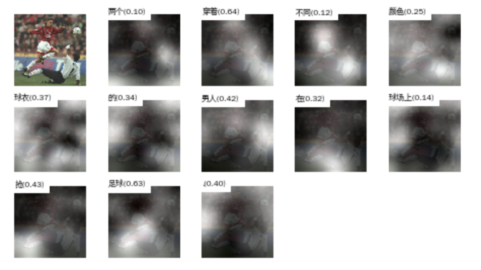

# Show, Attend and Tell 
* In this project we will implement a Chinese image caption model using TensorFlow.
* The dataset in the project is from [challenge.ai](https://challenger.ai/datasets/caption) which contains 240k manually labeled samples.
* Most code is reused from [source repo](https://github.com/yunjey/show-attend-and-tell)



## References
The source implement: https://github.com/yunjey/show-attend-and-tell

Author's theano code: https://github.com/kelvinxu/arctic-captions 

Another tensorflow implementation: https://github.com/jazzsaxmafia/show_attend_and_tell.tensorflow

<br/>


## Getting Started

### Prerequisites

First, clone this repo and [evaluation code](https://github.com/AIChallenger/AI_Challenger.git) in same directory.

```bash
$ git clone https://github.com/jeffrey1hu/show-attend-and-tell.git
$ git clone https://github.com/AIChallenger/AI_Challenger.git
```

This code is written in Python2.7 and requires [TensorFlow](https://www.tensorflow.org/versions/r0.11/get_started/os_setup.html#anaconda-installation). In addition, you need to install a few more packages to process [MSCOCO data set](http://mscoco.org/home/). I have provided a script to download the <i>MSCOCO image dataset</i> and [VGGNet19 model](http://www.vlfeat.org/matconvnet/pretrained/). Downloading the data may take several hours depending on the network speed. Run commands below then the images will be downloaded in `image/` directory and <i>VGGNet19 model</i> will be downloaded in `data/` directory.

```bash
$ cd show-attend-and-tell-tensorflow
$ pip install -r requirements.txt
$ chmod +x ./collect_data.sh
$ ./collect_data.sh
```


Before training the model, you have to preprocess the <i>Ai.challenge caption dataset</i>.
To resize the image to 224x224 and generate caption dataset and image feature vectors, run command below.

```bash
$ python prepro.py
```
<br>

### Train the model 

To train the image captioning model, run command below. 

```bash
$ python train.py
```
<br>

### (optional) Tensorboard visualization

I have provided a tensorboard visualization for real-time debugging.
Open the new terminal, run command below and open `http://localhost:6005/` into your web browser.

```bash
$ tensorboard --logdir='./log' --port=6005 
```
<br>

### Evaluate the model 

To generate captions, visualize attention weights and evaluate the model, please see `evaluate_model.ipynb`.


<br/>


